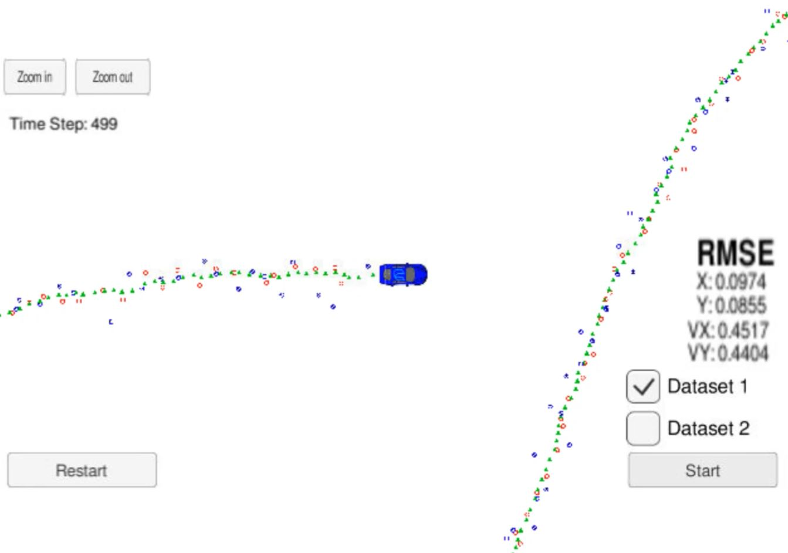
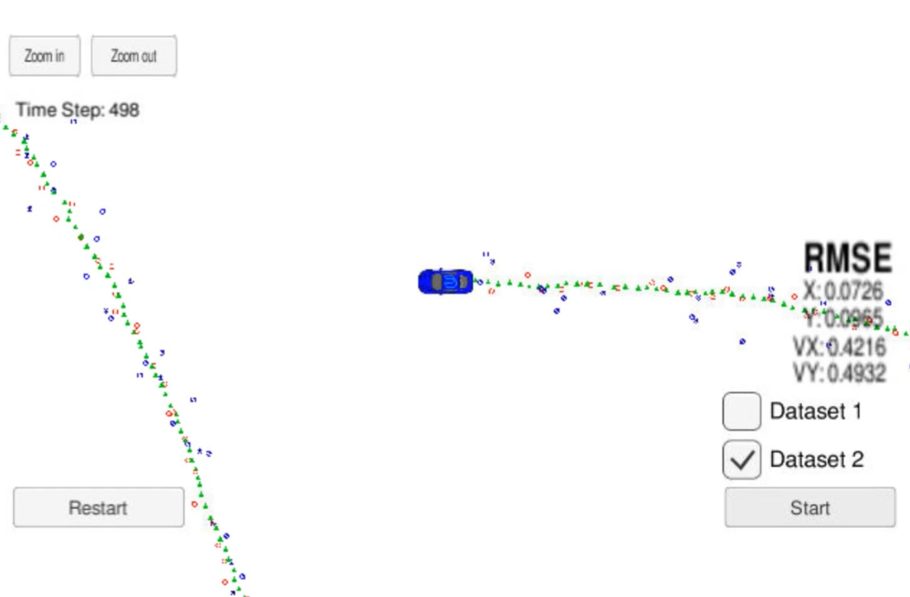

# Extended Kalman Filter Project

### Overview

In this project a kalman filter is utilized to estimate the state of a moving object of interest with noisy lidar and radar measurements. The RMSE values of sensing is calculated to check the quality of code.

### Environment 

This project involves the Simulator which can be downloaded [here](https://github.com/udacity/self-driving-car-sim/releases).

This repository includes two files that can be used to set up and install [uWebSocketIO](https://github.com/uWebSockets/uWebSockets) for either Linux or Mac systems. For windows you can use either Docker, VMware, or even [Windows 10 Bash on Ubuntu](https://www.howtogeek.com/249966/how-to-install-and-use-the-linux-bash-shell-on-windows-10/) to install uWebSocketIO. Please see the [uWebSocketIO Starter Guide]([file:///../Pages/12 uWebSocketIO Starter Guide.html) for the required version and installation scripts.

Once the install for uWebSocketIO is complete, the main program can be built and run by doing the following from the project top directory.

1. mkdir build
2. cd build
3. cmake ..
4. make
5. ./ExtendedKF

Tips for setting up your environment can be found through links below.

For [Windows]([file:///../Pages/13 Environment Setup (Windows).html), [Linux](file:///../Pages/14%20Environment%20Setup%20(Linux).html), [Mac](file:///../Pages/15%20Environment%20Setup%20(Mac).html).

### Other Important Dependencies

* cmake >= 3.5
  * All OSes: [click here for installation instructions](https://cmake.org/install/)
* make >= 4.1 (Linux, Mac), 3.81 (Windows)
  * Linux: make is installed by default on most Linux distros
  * Mac: [install Xcode command line tools to get make](https://developer.apple.com/xcode/features/)
  * Windows: [Click here for installation instructions](http://gnuwin32.sourceforge.net/packages/make.htm)
* gcc/g++ >= 5.4
  * Linux: gcc / g++ is installed by default on most Linux distros
  * Mac: same deal as make - [install Xcode command line tools](https://developer.apple.com/xcode/features/)
  * Windows: recommend using [MinGW](http://www.mingw.org/)

### Basic Build Instructions

1. Clone this repo.
2. Make a build directory: `mkdir build && cd build`
3. Compile: `cmake .. && make` 
   * On windows, you may need to run: `cmake .. -G "Unix Makefiles" && make`
4. Run it: `./ExtendedKF `

### Code Style

 [Google's C++ style guide](https://google.github.io/styleguide/cppguide.html).

### Core files of Kalman Filter Algorithm

- `main.cpp` 
  * communicates with the Simulator receiving data measurements. 
  * calls a function to run the Kalman filter.
  * calls a function to calculate RMSE.
- `FusionEKF.cpp` 
  * initialize variables and matrices (x, F, H_laser, H_jacobian, P, etc.). 
  * initialize the Kalman filter position vector with the first sensor measurements. 
  * modify the F and Q matrices prior to the prediction step based on the elapsed time between measurements. 
  * call the update step for either the lidar or radar sensor measurement. Because the update step for lidar and radar are slightly different, there are different functions for updating lidar and radar. 
- `kalman_filter.cpp`
  * defines the predict function, the update function for lidar, and the update function for radar.
- `tools.cpp`
  * function to calculate RMSE and the Jacobian matrix.

### How the Files Relate to Each Other

Here is a brief overview of what happens when you run the code files:

1. `Main.cpp` reads in the data and sends a sensor measurement to `FusionEKF.cpp`

2. `FusionEKF.cpp` takes the sensor data and initializes variables and updates variables. The Kalman filter equations are not in this file. `FusionEKF.cpp` has a variable called `ekf_`, which is an instance of a `KalmanFilter` class. The `ekf_` will hold the matrix and vector values. You will also use the `ekf_` instance to call the predict and update equations.

3. The `KalmanFilter` class is defined in `kalman_filter.cpp` and `kalman_filter.h`. It contains functions for the prediction and update steps.

### Results

My Extended Kalman Filter Algorithm produces the below results for dataset 1 and dataset 2. RMSE is the Root Mean Square Error.

|                    |   X    |   Y    |   VX   |   VY   |
| :----------------: | :----: | :----: | :----: | :----: |
| **Dataset 1** RMSE | 0.0974 | 0.0855 | 0.4517 | 0.4404 |
| **Dataset 2** RMSE | 0.0726 | 0.0965 | 0.4216 | 0.4932 |

RMSE is smaller than the requirement [.11, .11, 0.52, 0.52].

**Output Video:**

|                                            |                                            |
| :----------------------------------------: | :----------------------------------------: |
|               |               |
| [Video Link](https://youtu.be/rYsgKpfEoGo) | [Video Link](https://youtu.be/3CNdFyvIvz0) |

### Radar Vs Laser

In order to understand which sensor type provides more accurate readings. I compared the RMSE of situation when only Radar is working with that when only Laser is working.

|                      |   X    |   Y    | VX     | VY     |
| :------------------: | :----: | :----: | ------ | ------ |
| **Radar** Data Set 1 | 0.2302 | 0.3464 | 0.5835 | 0.8040 |
| **Radar** Data Set 2 | 0.2706 | 0.3853 | 0.6524 | 0.9218 |
| **Laser** Data Set 1 | 0.0973 | 0.0855 | 0.4513 | 0.4399 |
| **Laser** Data Set 2 | 0.1169 | 0.1260 | 0.6627 | 0.6024 |

From the table above we can see that **Laser sensor provides more accurate readings**.

